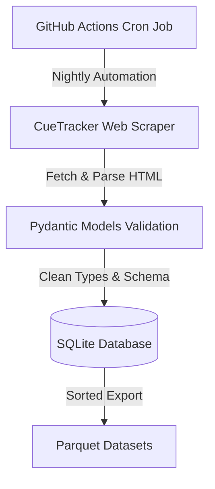

# SnookerDB

SnookerDB is a production-grade, automated data Ingestion pipeline that scrapes historical and current snooker match statistics from CueTracker and exposes them in SQLite and analytics-friendly Parquet formats.

Designed for unattended operations, SnookerDB executes nightly updates to keep records up-to-date while enforcing data integrity constraints, validating schemas, handling transient failures gracefully, and exporting clean outputs.

---

## Architecture



---

## Database Schema & Datasets

We collect and validate three main datasets:

### 1. players
Contains profile details of all professional players.
- url (TEXT, PRIMARY KEY): Unique identifier URL to CueTracker.
- first_name (TEXT): The player's first name.
- surname (TEXT): The player's surname.
- nationality (TEXT): The player's country.

### 2. tournament
Describes tournaments played since 1907.
- tourn_id (INTEGER, PRIMARY KEY): Unique tournament ID.
- url (TEXT): Direct URL to the tournament page.
- dates (TEXT): Scraped date ranges of the event.
- name (TEXT): Full name of the tournament.
- season (TEXT): Season code (e.g. 2025-2026).
- category (TEXT): Tournament category (e.g. Professional, Amateur).

### 3. matches
Describes individual match details and scores.
- match_id (INTEGER, PRIMARY KEY): Unique match ID.
- tourn_id (INTEGER, FOREIGN KEY): Reference to tournament(tourn_id).
- date (TEXT, Nullable): Date of the match.
- stage (TEXT): Round stage (e.g. Final, Semi Final).
- best_of (INTEGER): Frame limit.
- player_1_score (INTEGER): Frames won by player 1.
- player_2_score (INTEGER): Frames won by player 2.
- player_1 (TEXT): Player 1 name.
- player_1_url (TEXT): Player 1 URL lookup.
- player_2 (TEXT): Player 2 name.
- player_2_url (TEXT): Player 2 URL lookup.
- scores (TEXT, Nullable): Detailed frame-by-frame scores.
- walkover (INTEGER): Boolean flag (0 = Standard, 1 = Walkover).

### 4. frames
Describes individual frame scores parsed from match results.
- match_id (INTEGER, PRIMARY KEY, FOREIGN KEY): Reference to matches(match_id).
- frame_num (INTEGER, PRIMARY KEY): The frame number in the match.
- player_1_score (INTEGER): Points scored by player 1 in the frame.
- player_2_score (INTEGER): Points scored by player 2 in the frame.

### 5. breaks
Describes significant scoring breaks during frames.
- match_id (INTEGER, FOREIGN KEY): Reference to matches(match_id).
- frame_num (INTEGER): The frame number in the match.
- player_number (INTEGER): The player who made the break (1 or 2).
- points (INTEGER): The break score points.

---

## Project Structure

```
snookerdb/
├── .github/
│   └── workflows/
│       ├── main.yml          # Nightly cron pipeline
│       └── test.yml          # CI test runner on commits
├── Code/
│   ├── models.py             # Pydantic models for validation
│   ├── scraper.py            # Core HTTP scrape and BS4 parsers
│   ├── initialize_db.py      # Clean full historical scrape and DB init
│   ├── update_db.py          # Nightly incremental update
│   └── export_parquet.py     # SQLite to Parquet sorted export
├── Database/
│   ├── schema.sql            # SQLite schema definitions
│   └── snookerdb.db          # SQLite binary database file
├── Parquet/
│   ├── players.parquet       # Stable sorted players Parquet export
│   ├── tournament.parquet    # Stable sorted tournament Parquet export
│   └── matches.parquet       # Stable sorted matches Parquet export
├── tests/
│   ├── conftest.py           # Shared pytest fixtures
│   ├── fixtures/             # Offline mock HTML data
│   ├── test_parsers.py       # HTML parsing unit tests
│   ├── test_storage.py       # DB schema & insertion integration tests
│   └── test_e2e.py           # Pipeline e2e test (mocked requests)
├── pyproject.toml            # Ruff, Mypy, and Pytest configuration
├── requirements.txt          # Python dependencies
└── README.md                 # Project Documentation
```

---

## Getting Started

### Prerequisites
- Python 3.11 or higher.

### Installation
1. Clone this repository.
2. Install the required libraries:
   ```bash
   pip install -r requirements.txt
   ```
3. (Optional) Install development and testing dependencies:
   ```bash
   pip install pytest pytest-cov responses ruff mypy types-requests
   ```

---

## Usage

### 1. Initialize the Database
To run a clean full historical scrape (this will wipe existing database tables and fetch all history):
```bash
python Code/initialize_db.py
```

### 2. Nightly Scraper Update
To run an incremental scraper update that fetches the current season's tournaments and checks for new matches/players:
```bash
python Code/update_db.py
```
*Note: This script only queries listing pages for players that are not currently in the database, optimizing network usage.*

### 3. Parquet Export
To sync the SQLite data into Parquet format:
```bash
python Code/export_parquet.py
```
*Note: Exports are sorted stably by keys to prevent noisy git diffs when checked in.*

---

## Testing & Code Quality

Our testing framework uses pytest and mocks network requests using responses library to verify functionality offline.

### Running Tests
To run the full test suite and inspect code coverage:
```bash
pytest --cov=Code tests/
```

### Linter & Static Analysis
To check styling and type safety:
```bash
# Style & PEP-8 checks
ruff check Code/

# Type check
mypy Code/
```

---

## Automation

The ingestion pipeline runs automatically every night at 00:30 UTC via GitHub Actions. If new matches are played:
1. update_db.py runs, adding new matches/players incrementally.
2. export_parquet.py refreshes the Parquet datasets.
3. The runner commits the updated SQLite and Parquet files back to main using secure noreply credentials.
