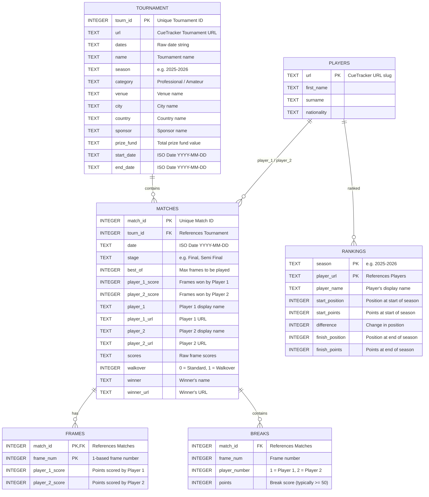

# SnookerDB Data Dictionary

This document provides a comprehensive schema description and semantic definition for all tables in the SnookerDB database.

---

## Entity Relationship Overview

The SnookerDB schema models players, tournaments, matches, frame-by-frame scores, high scoring breaks, and seasonal world rankings.

---

## Tables

### 1. `players`
Contains details of all professional and participating players in the database.

| Column Name | SQLite Type | Constraints | Description | Sample Value |
|:---|:---|:---|:---|:---|
| **`url`** | `TEXT` | `PRIMARY KEY` | Unique CueTracker URL slug identifying the player. | `ronnie-osullivan` |
| **`first_name`** | `TEXT` | None | The player's first name. | `Ronnie` |
| **`surname`** | `TEXT` | None | The player's surname. | `O'Sullivan` |
| **`nationality`** | `TEXT` | None | The player's country of representation. | `England` |

---

### 2. `tournament`
Describes tournaments played since 1907.

| Column Name | SQLite Type | Constraints | Description | Sample Value |
|:---|:---|:---|:---|:---|
| **`tourn_id`** | `INTEGER` | `PRIMARY KEY` | Unique identifier generated for the tournament event. | `1540` |
| **`url`** | `TEXT` | None | Direct URL path to the tournament page on CueTracker. | `https://cuetracker.net/tournaments/world-championship/2026/1540` |
| **`dates`** | `TEXT` | None | Raw date range text scraped from the page. | `Apr 18 to May 4, 2026` |
| **`name`** | `TEXT` | None | The full official name of the tournament. | `World Championship` |
| **`season`** | `TEXT` | None | The snooker season (formatted as YYYY-YYYY). | `2025-2026` |
| **`category`** | `TEXT` | None | Category of the tournament (e.g. `Professional`, `Amateur`, `Seniors`). | `Professional` |
| **`venue`** | `TEXT` | Nullable | The specific arena/venue where the tournament was played. | `Crucible Theatre` |
| **`city`** | `TEXT` | Nullable | The city in which the tournament was hosted. | `Sheffield` |
| **`country`** | `TEXT` | Nullable | The country in which the tournament was hosted. | `England` |
| **`sponsor`** | `TEXT` | Nullable | The primary tournament sponsor. | `Cazoo` |
| **`prize_fund`** | `TEXT` | Nullable | Total prize fund description (e.g., text or monetary amount). | `£2,395,000` |
| **`start_date`** | `TEXT` | Nullable | Parsed start date of the tournament in `YYYY-MM-DD` ISO format. | `2026-04-18` |
| **`end_date`** | `TEXT` | Nullable | Parsed end date of the tournament in `YYYY-MM-DD` ISO format. | `2026-05-04` |

---

### 3. `matches`
Describes individual match details and scores.

| Column Name | SQLite Type | Constraints | Description | Sample Value |
|:---|:---|:---|:---|:---|
| **`match_id`** | `INTEGER` | `PRIMARY KEY` | Unique identifier generated for the match. | `84512` |
| **`tourn_id`** | `INTEGER` | `FOREIGN KEY` | References `tournament(tourn_id)`. | `1540` |
| **`date`** | `TEXT` | Nullable | Date of the match in `YYYY-MM-DD` ISO format. | `2026-05-04` |
| **`stage`** | `TEXT` | None | Stage of the tournament round. | `Final` |
| **`best_of`** | `INTEGER` | None | Maximum number of frames that could be played in the match. | `35` |
| **`player_1_score`** | `INTEGER` | None | Frames won by player 1. | `18` |
| **`player_2_score`** | `INTEGER` | None | Frames won by player 2. | `14` |
| **`player_1`** | `TEXT` | None | Display name of player 1. | `Ronnie O'Sullivan` |
| **`player_1_url`** | `TEXT` | Nullable | CueTracker URL slug for player 1. | `ronnie-osullivan` |
| **`player_2`** | `TEXT` | None | Display name of player 2. | `Judd Trump` |
| **`player_2_url`** | `TEXT` | Nullable | CueTracker URL slug for player 2. | `judd-trump` |
| **`scores`** | `TEXT` | Nullable | Raw frame scores representation. | `65-12, 104-0 (104), 12-78` |
| **`walkover`** | `INTEGER` | None | Boolean flag (`0` for normal, `1` if the match was a walkover). | `0` |
| **`winner`** | `TEXT` | Nullable | The name of the player who won the match. | `Ronnie O'Sullivan` |
| **`winner_url`** | `TEXT` | Nullable | CueTracker URL slug for the winner. | `ronnie-osullivan` |

---

### 4. `frames`
Describes individual frame scores parsed from match results. Useful for frame-by-frame and point-level analysis.

| Column Name | SQLite Type | Constraints | Description | Sample Value |
|:---|:---|:---|:---|:---|
| **`match_id`** | `INTEGER` | `PRIMARY KEY`, `FOREIGN KEY` | References `matches(match_id)`. | `84512` |
| **`frame_num`** | `INTEGER` | `PRIMARY KEY` | 1-based index of the frame in the match. | `2` |
| **`player_1_score`** | `INTEGER` | None | Total points scored by player 1 in this frame. | `104` |
| **`player_2_score`** | `INTEGER` | None | Total points scored by player 2 in this frame. | `0` |

---

### 5. `breaks`
Tracks significant individual scoring breaks (runs of consecutive points without missing) made within a frame. Typically captures breaks of 50 or more points (including century breaks of 100+).

| Column Name | SQLite Type | Constraints | Description | Sample Value |
|:---|:---|:---|:---|:---|
| **`match_id`** | `INTEGER` | `FOREIGN KEY` | References `matches(match_id)`. | `84512` |
| **`frame_num`** | `INTEGER` | None | The frame number in which the break was constructed. | `2` |
| **`player_number`** | `INTEGER` | None | Indicator of the break builder (`1` = Player 1, `2` = Player 2). | `1` |
| **`points`** | `INTEGER` | None | Total points scored in this single break sequence. | `104` |

---

### 6. `rankings`
Tracks the world rankings of players per season.

| Column Name | SQLite Type | Constraints | Description | Sample Value |
|:---|:---|:---|:---|:---|
| **`season`** | `TEXT` | `PRIMARY KEY` | Season of the ranking table (e.g. `2025-2026`). | `2025-2026` |
| **`player_url`** | `TEXT` | `PRIMARY KEY`, `FOREIGN KEY` | References `players(url)`. | `judd-trump` |
| **`player_name`** | `TEXT` | None | Display name of the player. | `Judd Trump` |
| **`start_position`** | `INTEGER` | Nullable | World ranking position at the start of the season. | `2` |
| **`start_points`** | `INTEGER` | Nullable | Ranking points accumulator at the start of the season. | `980200` |
| **`difference`** | `INTEGER` | Nullable | Change in rank position during the season (negative indicates drop). | `1` |
| **`finish_position`** | `INTEGER` | Nullable | World ranking position at the end of the season. | `1` |
| **`finish_points`** | `INTEGER` | Nullable | Ranking points accumulator at the end of the season. | `1250000` |
