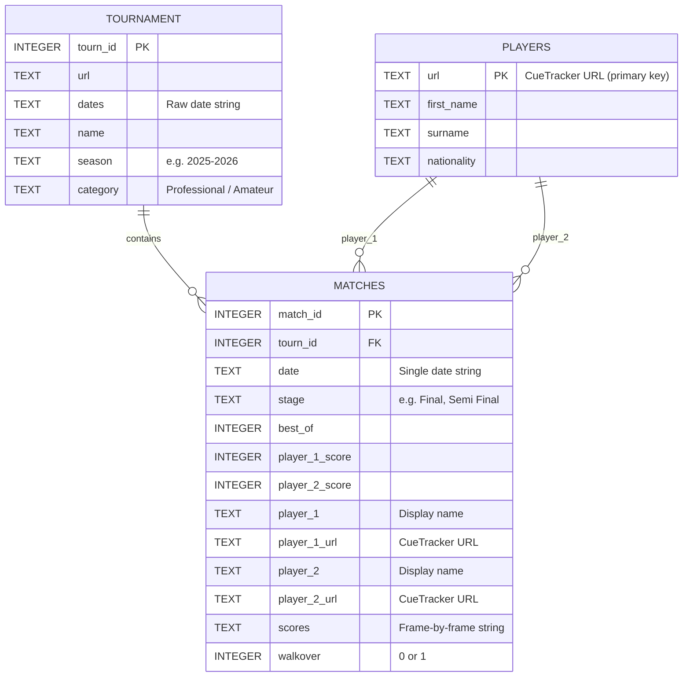

# SnookerDB — Feature Gap Analysis & Future Roadmap

> **Reviewer**: Senior Sports Data Platform Engineer  
> **Date**: 2026-06-06  
> **Scope**: Feature completeness, data coverage, analytics potential, API design, and strategic vision  
> **Premise**: Code quality, testing, CI/CD, and reliability have already been addressed. This review focuses exclusively on *what the project does* — not *how well it does it*.

---

## Table of Contents

1. [Current Domain Model](#step-1-current-domain-model)
2. [Missing Data Inventory](#step-2-missing-data-inventory)
3. [Feature Gap Analysis](#step-3-feature-gap-analysis)
4. [API & Consumer Experience](#step-4-api--consumer-experience)
5. [Data Product Opportunities](#step-5-data-product-opportunities)
6. [Comparison Against Best-in-Class](#step-6-comparison-against-best-in-class)
7. [Open Source Maturity Review](#step-7-open-source-maturity-review)
8. [Missing Feature Inventory (Full)](#deliverable-1-missing-feature-inventory)
9. [Top 25 High-Impact Opportunities](#deliverable-2-top-25-high-impact-opportunities)
10. [Vision Roadmap](#deliverable-3-vision-roadmap)
11. ["If This Were My Project"](#deliverable-4-if-this-were-my-project)

---

## Step 1: Current Domain Model

### What Exists Today

The project models exactly **three entities** with a simple relational structure:



### What Is Captured

| Category | What's Collected | Completeness |
|----------|-----------------|--------------|
| **Players** | Name, nationality, CueTracker URL | 🟡 Minimal — 4 fields only |
| **Tournaments** | ID, name, dates (as string), season, category | 🟡 Minimal — no venue, no prize, no format |
| **Matches** | Scores, stage, best_of, frame scores (raw string), walkover flag | 🟡 Moderate — good core, but no derived data |
| **Seasons** | Used as scraping navigation; stored only as tournament attribute | 🔴 Not a first-class entity |
| **Rankings** | Not collected | 🔴 Missing entirely |
| **Frames** | Embedded as a single concatenated string in matches.scores | 🔴 Not structured |
| **Breaks** | Not collected | 🔴 Missing entirely |
| **Venues** | Not collected | 🔴 Missing entirely |
| **Referees** | Not collected | 🔴 Missing — available on CueTracker match pages |
| **Prize money** | Not collected | 🔴 Missing — available at `/prize-money/won/` |
| **Head-to-head** | Not computed | 🔴 Missing entirely |

### Honest Assessment

> The current data model is a **minimum viable scrape**. It captures the skeleton of snooker results — who played whom, what was the score — but throws away almost everything that makes snooker data *interesting*. The frame scores exist as a raw string that no downstream consumer can query. There are no centuries, no break data, no rankings, no venues, no career statistics. A user who downloads this data can answer "who won?" but not "how did they win?" or "how good are they?"

---

## Step 2: Missing Data Inventory

### Player Data

| Field | Currently Captured | Available on CueTracker | Gap |
|-------|-------------------|------------------------|-----|
| Name | ✅ first_name, surname | ✅ | — |
| Nationality | ✅ | ✅ | — |
| Date of birth | ❌ | ✅ snooker.org API / Wikipedia | 🔴 Missing — CueTracker lacks this; use snooker.org API |
| Handedness | ❌ | ✅ snooker.org API | 🔴 Missing — CueTracker lacks this; use snooker.org API |
| Professional debut year | ❌ | ✅ Derivable from earliest match / snooker.org | 🔴 Missing |
| Amateur/Tour status | ❌ | ✅ Partially (category on tournaments) | 🟡 Derivable |
| Career earnings | ❌ | ✅ CueTracker `/prize-money/won/` + player profiles | 🔴 Missing |
| Career total statistics | ❌ | ✅ CueTracker `/players/{name}/career-total-statistics` | 🔴 Missing — dedicated endpoint exists! |
| Highest break | ❌ | ✅ CueTracker player profiles | 🔴 Missing |
| Century breaks count | ❌ | ✅ CueTracker `/centuries/most-made/` + profiles | 🔴 Missing |
| Maximum 147 breaks | ❌ | ✅ CueTracker dedicated section | 🔴 Missing |
| Ranking history | ❌ | ✅ CueTracker (season-by-season) | 🔴 Missing |
| Season-specific stats | ❌ | ✅ CueTracker `/players/{name}/season/{YYYY-YYYY}` | 🔴 Missing |
| Profile images | ❌ | ✅ CueTracker has photos | 🟡 Low priority |
| Current world ranking | ❌ | ✅ CueTracker rankings page | 🔴 Missing |

> [!IMPORTANT]
> CueTracker player profile pages (e.g. `/players/ronnie-osullivan`) contain a wealth of data that the current scraper completely ignores. The scraper only visits the **player listing pages** (`/players/a`, `/players/b`, etc.) which contain just name, nationality, and URL. **Individual player profile pages are never visited.** Additionally, CueTracker has dedicated endpoints for career statistics (`/players/{name}/career-total-statistics`), season-specific stats (`/players/{name}/season/{YYYY-YYYY}`), centuries (`/centuries/most-made/`), prize money (`/prize-money/won/`), and head-to-head (`/head-to-head/{player-one}/{player-two}/`). A secondary source — the **snooker.org API** (`api.snooker.org`) — provides JSON data including biographical fields (DOB, handedness) that CueTracker lacks. Access requires emailing `webmaster@snooker.org` for an `X-Requested-By` header.

### Match Data

| Field | Currently Captured | Available on CueTracker | Gap |
|-------|-------------------|------------------------|-----|
| Match result (scores) | ✅ | ✅ | — |
| Stage/round | ✅ | ✅ | — |
| Best of | ✅ | ✅ | — |
| Date | ✅ (single string) | ✅ | 🟡 Not parsed to proper date |
| Frame-by-frame scores | ✅ (raw concatenated string) | ✅ | 🟡 Not structured/parsed |
| Walkover flag | ✅ | ✅ | — |
| Century breaks (per match) | ❌ | ✅ Frame scores contain this | 🔴 Derivable but not derived |
| Maximum breaks | ❌ | ✅ CueTracker tracks these | 🔴 Missing |
| Match duration | ❌ | ❌ Not on CueTracker | ⬜ Unavailable |
| Session information | ❌ | 🟡 Partially (multi-day matches) | 🟡 Partially available |
| Referee | ❌ | ✅ Available in match details on CueTracker | 🔴 Missing — scraper doesn't extract this |
| Retirement/withdrawal flag | ❌ | ✅ Implied in walkover logic | 🟡 Not distinguished from walkover |
| Winner determination | ❌ | ✅ Derivable from scores | 🔴 Not computed |
| Match result type | ❌ | ✅ (standard/walkover/retirement) | 🔴 Not modelled |

### Tournament Data

| Field | Currently Captured | Available on CueTracker | Gap |
|-------|-------------------|------------------------|-----|
| Name | ✅ | ✅ | — |
| Dates | ✅ (raw string) | ✅ | 🟡 Not parsed |
| Season | ✅ | ✅ | — |
| Category | ✅ | ✅ | — |
| Venue | ❌ | ✅ Tournament page header — confirmed available | 🔴 Missing |
| City | ❌ | ✅ Tournament page — confirmed available | 🔴 Missing |
| Country | ❌ | ✅ Tournament page — confirmed available | 🔴 Missing |
| Sponsor name | ❌ | 🟡 Part of tournament name | 🟡 Extractable |
| Format (short/long) | ❌ | 🟡 Derivable from best_of per round | 🟡 Derivable |
| Prize fund | ❌ | ✅ Some tournament pages | 🟡 Partial availability |
| Winner | ❌ | ✅ Derivable from final match | 🔴 Not computed |
| Draw size | ❌ | ✅ Derivable from match data | 🔴 Not computed |
| Qualification structure | ❌ | 🟡 Partial (stages in matches) | 🟡 Partially derivable |
| Historical records | ❌ | ❌ Would need manual curation | ⬜ Not available |

### Ranking Data

| Field | Status | Gap |
|-------|--------|-----|
| World rankings table | ❌ Not collected | 🔴 Critical gap — this is foundational data |
| Historical rankings (per season) | ❌ Not collected | 🔴 Critical gap |
| Ranking points per player | ❌ Not collected | 🔴 Critical gap |
| One-year ranking list | ❌ Not collected | 🔴 Missing |
| Prize money ranking | ❌ Not collected | 🟡 Lower priority |
| Ranking movements | ❌ Not computed | 🔴 Missing (derivable if rankings collected) |

> [!WARNING]
> **Rankings are the single biggest data gap.** Snooker rankings are essential for virtually any analysis — seedings, player strength estimation, historical comparison, form assessment. Without rankings, the database is like a football database without league tables. CueTracker has historical ranking data available on player profiles and dedicated ranking pages.

### Statistics & Derived Data

| Statistic | Status | Source |
|-----------|--------|--------|
| Century totals (career) | ❌ | Derivable from frame scores |
| Century totals (per season) | ❌ | Derivable |
| Maximum 147 breaks | ❌ | CueTracker + derivable |
| Win rates (career) | ❌ | Derivable from matches |
| Win rates (per season) | ❌ | Derivable |
| Head-to-head records | ❌ | Derivable from matches |
| Frame win percentages | ❌ | Derivable from match scores |
| Deciding-frame performance | ❌ | Derivable (where p1+p2 score = best_of) |
| Average frames per match | ❌ | Derivable |
| Tournament win counts | ❌ | Derivable |
| Titles by category | ❌ | Derivable |
| Streak data (consecutive wins) | ❌ | Derivable |

> [!NOTE]
> A huge amount of statistical value is **already latent in the existing data** but has never been extracted or computed. The `scores` field in particular is a goldmine that's being stored as an opaque string.

---

## Step 3: Feature Gap Analysis

### 3.1 Historical Research

A researcher studying snooker history would want:

| Feature | Status | Feasibility | Value |
|---------|--------|-------------|-------|
| Player career timelines | ❌ | 🟢 High — data exists | ⭐⭐⭐⭐⭐ |
| Ranking history (year-by-year) | ❌ | 🟢 High — needs scraping player profiles | ⭐⭐⭐⭐⭐ |
| Tournament histories (all winners, records) | ❌ | 🟢 High — derivable from matches | ⭐⭐⭐⭐ |
| Record books (most titles, highest breaks, etc.) | ❌ | 🟢 High — derivable + some scraping | ⭐⭐⭐⭐ |
| Era comparison (different rule eras) | ❌ | 🟡 Medium — needs manual era tagging | ⭐⭐⭐ |
| Season summaries | ❌ | 🟢 High — derivable | ⭐⭐⭐⭐ |
| All-time records and milestones | ❌ | 🟢 High — derivable | ⭐⭐⭐⭐ |

### 3.2 Analytics

| Feature | Status | Feasibility | Value |
|---------|--------|-------------|-------|
| Elo ratings | ❌ | 🟢 High — straightforward algorithm | ⭐⭐⭐⭐⭐ |
| Glicko ratings | ❌ | 🟢 High — extension of Elo | ⭐⭐⭐⭐ |
| Form metrics (recent N-match performance) | ❌ | 🟢 High — simple windowed stats | ⭐⭐⭐⭐ |
| Surface/venue performance | ❌ | 🟡 Medium — needs venue data first | ⭐⭐⭐ |
| Strength-of-schedule | ❌ | 🟢 High — needs Elo/rankings | ⭐⭐⭐⭐ |
| Momentum/streaks | ❌ | 🟢 High — derivable | ⭐⭐⭐ |
| Tournament difficulty index | ❌ | 🟢 High — composite of opponent Elo | ⭐⭐⭐ |
| Age curves / peak performance | ❌ | 🟡 Medium — needs DOB data | ⭐⭐⭐⭐ |
| Clutch metrics (deciding frames) | ❌ | 🟢 High — derivable from scores | ⭐⭐⭐⭐ |

### 3.3 Betting & Modelling

| Feature | Status | Feasibility | Value |
|---------|--------|-------------|-------|
| Pre-match win probabilities (Elo-derived) | ❌ | 🟢 High | ⭐⭐⭐⭐⭐ |
| Ranking-based forecasts | ❌ | 🟢 High — needs rankings | ⭐⭐⭐⭐ |
| Player strength estimates | ❌ | 🟢 High — via Elo/Glicko | ⭐⭐⭐⭐⭐ |
| Tournament simulation | ❌ | 🟡 Medium — needs draw structure + probabilities | ⭐⭐⭐⭐ |
| Match-level expected outcomes | ❌ | 🟡 Medium | ⭐⭐⭐ |
| Historical odds data | ❌ | 🔴 Low — requires external sources | ⭐⭐⭐ |
| Frame-level modelling | ❌ | 🟡 Medium — needs structured frame data | ⭐⭐⭐ |

### 3.4 Data Science

| Feature | Status | Feasibility | Value |
|---------|--------|-------------|-------|
| Feature generation (ML-ready) | ❌ | 🟡 Medium — needs derived stats first | ⭐⭐⭐⭐ |
| Historical snapshots (point-in-time data) | ❌ | 🟡 Medium — needs data versioning | ⭐⭐⭐⭐ |
| ML-ready datasets (flat tables for modelling) | ❌ | 🟢 High — reformatting exercise | ⭐⭐⭐⭐ |
| Data versioning / changelog | ❌ | 🟡 Medium — Git provides some of this | ⭐⭐⭐ |
| Pre-computed feature tables | ❌ | 🟢 High — derivation pipeline | ⭐⭐⭐⭐ |

### 3.5 Live Data

| Feature | Status | Feasibility | Value |
|---------|--------|-------------|-------|
| Live scoring | ❌ | 🔴 Low — CueTracker doesn't have live data; would need WST or flashscore | ⭐⭐⭐⭐ |
| Event streaming | ❌ | 🔴 Low — architecture doesn't support real-time | ⭐⭐⭐ |
| Match state tracking | ❌ | 🔴 Low — batch architecture only | ⭐⭐⭐ |
| Notifications / webhooks | ❌ | 🟡 Medium — could notify on nightly changes | ⭐⭐ |

> [!TIP]
> **Live data is the least feasible and should be lowest priority.** The project's batch-oriented architecture and CueTracker source make real-time data impractical. Focus instead on making historical and analytical data exceptional.

---

## Step 4: API & Consumer Experience

### Current State

There is **no API, no query interface, and no Python library**. The project's output is:

1. A raw SQLite file (`snookerdb.db` — 27 MB)
2. Three Parquet files (`players.parquet`, `tournament.parquet`, `matches.parquet`)
3. That's it.

A consumer must:
- Clone the entire repo (including git history of binary files)
- Load SQLite or Parquet manually
- Write their own SQL/pandas queries
- Parse the raw `scores` string themselves
- Compute any derived statistics from scratch

### What a User Would Expect

The user provided these aspirational examples:

```python
# None of these work today — there is no Python API at all.

db.player("ronnie-osullivan")
db.player("ronnie-osullivan").ranking_history()
db.player("ronnie-osullivan").career_centuries()
db.tournament("world-championship").winners()
db.head_to_head("ronnie-osullivan", "judd-trump")
db.rankings(date="2024-01-01")
```

### Assessment

| Dimension | Rating | Notes |
|-----------|--------|-------|
| **Discoverability** | 🔴 Poor | No Python package to `pip install`; no documentation of data schema beyond README |
| **Ease of use** | 🔴 Poor | Consumer must clone repo and write raw SQL/pandas; no helper functions |
| **API ergonomics** | 🔴 None | No API exists — project is purely a data pipeline, not a data product |
| **Query capabilities** | 🔴 Basic | Raw SQL only; no pre-built queries, views, or analytical functions |
| **Data access** | 🟡 Functional | SQLite and Parquet are standard formats, but require manual download |

### Recommended API Architecture

The project should evolve from a **scraping pipeline** to a **data library**. This means building a Python package that wraps the database:

```python
# Future: pip install snookerdb
import snookerdb

# Load database (downloads or uses local cache)
db = snookerdb.load()

# Player queries
player = db.players.get("ronnie-osullivan")
player.name           # "Ronnie O'Sullivan"
player.nationality    # "England"
player.dob            # datetime(1975, 12, 5)
player.titles()       # DataFrame of tournament wins
player.ranking_history()  # DataFrame: season → rank
player.career_stats() # Dict: matches_played, win_rate, centuries, etc.

# Match queries
db.matches.season("2024-2025")           # All matches in a season
db.matches.tournament("world-championship", 2024)  # Tournament matches
db.matches.player("ronnie-osullivan")    # All of a player's matches
db.matches.between("ronnie-osullivan", "judd-trump")  # Head-to-head

# Tournament queries
db.tournaments.get("world-championship") # Tournament metadata
db.tournaments.season("2024-2025")       # All tournaments in a season
db.tournaments.winners("world-championship")  # Historical winners

# Ranking queries
db.rankings.current()                    # Current rankings table
db.rankings.at("2024-01-01")             # Historical snapshot
db.rankings.history("ronnie-osullivan")  # Player ranking over time

# Analytics
db.elo.current()                         # Current Elo ratings
db.elo.history("ronnie-osullivan")       # Elo timeline
db.elo.predict("ronnie-osullivan", "judd-trump")  # Win probability

# Data export
db.to_csv("output/")                     # Export all tables as CSV
db.to_parquet("output/")                 # Export as Parquet
db.to_duckdb("output/snooker.duckdb")   # Export as DuckDB
```

This is the pattern used by the most successful sports data libraries (pybaseball, nflfastR, worldfootballR).

---

## Step 5: Data Product Opportunities

### 5.1 Derived Datasets (High Value)

| Dataset | Description | Source | Effort |
|---------|------------|--------|--------|
| **Elo ratings** | Historical Elo rating for every player at every point in time | Compute from match results | 🟢 Medium (40-80 hrs) |
| **Parsed frame scores** | Structured table of individual frame scores (frame_num, player_1_break, player_2_break) | Parse existing `scores` string | 🟢 Easy (16-24 hrs) |
| **Head-to-head tables** | Pre-computed head-to-head records between all player pairs | Aggregate from matches | 🟢 Easy (8-16 hrs) |
| **Tournament summaries** | Winners, runners-up, draw sizes, prize money per tournament per year | Aggregate from matches + new scraping | 🟢 Easy (16-24 hrs) |
| **Season summaries** | Per-player season stats (matches, wins, centuries, ranking movement) | Aggregate + rankings | 🟡 Medium (24-40 hrs) |
| **Career statistics** | Comprehensive career stats for each player | Aggregate all data | 🟡 Medium (24-40 hrs) |
| **Century break register** | Every century break with player, score, tournament, date | Parse frame scores | 🟢 Easy (16-24 hrs) |

### 5.2 Research Datasets

| Dataset | Description | Users | Effort |
|---------|------------|-------|--------|
| **Player careers (long format)** | One row per player-season with stats | Academics, journalists | 🟡 Medium |
| **Match histories (ML format)** | Flat table with pre-computed features (Elo, form, h2h) for each match | Data scientists | 🟡 Medium |
| **Frame histories** | Individual frame-level data with break information | Detailed analysts | 🟡 Medium |
| **Ranking snapshots** | Rankings at regular intervals (yearly, monthly if available) | Historians | 🟡 Medium |
| **Upset register** | Matches where a lower-ranked player beat a higher-ranked one, with magnitude | Journalists | 🟢 Easy |

### 5.3 Statistical Models

| Model | Description | Value | Effort |
|-------|------------|-------|--------|
| **Elo/Glicko rating system** | Quantitative player strength estimation | ⭐⭐⭐⭐⭐ | 🟡 Medium |
| **Win probability model** | Pre-match probability estimates | ⭐⭐⭐⭐⭐ | 🟡 Medium |
| **Tournament simulation** | Monte Carlo sim of tournament brackets | ⭐⭐⭐⭐ | 🟡 Medium |
| **Ranking projection** | Projected future rankings based on remaining events | ⭐⭐⭐⭐ | 🟡 Medium-High |
| **Player clustering** | Grouping players by playing style/profile | ⭐⭐⭐ | 🟡 Medium |

### 5.4 Public API

| Endpoint Type | Description | Value | Effort |
|---------------|------------|-------|--------|
| **REST API** (FastAPI) | Query players, matches, tournaments, rankings via HTTP | ⭐⭐⭐⭐ | 🟡 Medium (40-60 hrs) |
| **GraphQL API** | Flexible queries with relationships | ⭐⭐⭐ | 🔴 High (80+ hrs) |
| **GitHub Releases as data API** | Versioned dataset releases (like nflverse-data) | ⭐⭐⭐⭐⭐ | 🟢 Easy (8-16 hrs) |

### 5.5 Data Exports

| Format | Current | Value | Effort |
|--------|---------|-------|--------|
| **SQLite** | ✅ Already provided | ⭐⭐⭐⭐ | — |
| **Parquet** | ✅ Already provided | ⭐⭐⭐⭐⭐ | — |
| **CSV** | ❌ | ⭐⭐⭐ | 🟢 Trivial (2-4 hrs) |
| **DuckDB** | ❌ | ⭐⭐⭐⭐ | 🟢 Easy (4-8 hrs) |
| **JSON/NDJSON** | ❌ | ⭐⭐⭐ | 🟢 Trivial (2-4 hrs) |
| **GitHub Releases** | ❌ | ⭐⭐⭐⭐⭐ | 🟢 Easy (8 hrs) |

> [!TIP]
> **The single highest-impact data product opportunity is GitHub Releases for datasets.** Following the nflverse-data pattern — publishing versioned Parquet/CSV files as GitHub Release assets — would make the data instantly accessible to any analyst without cloning the repo. This is trivial to implement and dramatically improves accessibility.

---

## Step 6: Comparison Against Best-in-Class

### Competitive Landscape

| Project | Sport | Key Strengths | What SnookerDB Can Learn |
|---------|-------|--------------|--------------------------|
| **[FBref](https://fbref.com)** | Football | Comprehensive stats, advanced metrics (xG, xA), player comparison tools, historical data back to 1800s | **Depth of derived statistics** — FBref doesn't just store results, it computes dozens of advanced metrics. SnookerDB should compute Elo, form, clutch metrics. |
| **[nflverse](https://github.com/nflverse)** | NFL | Ecosystem of R packages, play-by-play data, pre-computed EPA/WPA, GitHub Releases for data distribution | **Data distribution model** — nflverse publishes data as GitHub Release assets. Users load data directly from URLs. No repo cloning needed. Also the **ecosystem approach**: separate packages for data access, analytics, modelling. |
| **[pybaseball](https://github.com/jldbc/pybaseball)** | Baseball | `pip install pybaseball`, one-line data access (`pitching_stats(2024)`), Statcast data, FanGraphs integration | **API simplicity** — `import pybaseball; pybaseball.batting_stats(2024)` returns a DataFrame immediately. This is the gold standard for ease of use. SnookerDB should aspire to `import snookerdb; snookerdb.matches(season="2024-2025")`. |
| **[cricsheet](https://cricsheet.org/)** | Cricket | Ball-by-ball data in structured YAML/CSV/JSON, covers all formats (Test, ODI, T20), well-documented schema | **Granularity** — cricsheet models cricket at the ball level. SnookerDB should at minimum model at the frame level, not just match level. The `scores` string must be parsed into structured frame records. |
| **[worldfootballR](https://github.com/JaseZiv/worldfootballR)** | Football | R package, scrapes from multiple sources (FBref, Transfermarkt, Understat), clean API, great documentation | **Multi-source strategy** — worldfootballR aggregates data from 5+ sources. SnookerDB could supplement CueTracker with snooker.org, WST, and Wikipedia for rankings, prize money, and biographical data. |
| **[Understat](https://understat.com/)** | Football | Expected goals (xG) model, shot-level data, player/team comparison | **Advanced metrics as differentiator** — Understat's value is the derived xG metric, not the raw data. SnookerDB's "xG" could be Elo ratings and win probabilities — computed metrics that don't exist elsewhere in a machine-readable format. |
| **[tennis-data.co.uk](http://tennis-data.co.uk/)** | Tennis | Historical match data with betting odds, ATP/WTA rankings, clean CSV downloads | **Simplicity of distribution** — plain CSV files, well-documented, updated regularly. No installation required. Also shows the value of **including betting odds** alongside match data. |

### Key Lessons

1. **Be a library, not just a pipeline.** Every successful sports data project is installable (`pip install`, CRAN package) and provides a programmatic API. SnookerDB is currently invisible to anyone who doesn't manually browse GitHub.

2. **Compute and ship derived metrics.** Raw match results are commodity data — CueTracker already provides this. The value-add is in computed metrics: Elo ratings, win probabilities, form indices, head-to-head tables. These are what researchers, journalists, and bettors actually need.

3. **Distribute data via URLs, not git clones.** The nflverse model of publishing datasets as GitHub Release assets is transformative. A user can load data with `pd.read_parquet("https://github.com/obrienjoey/snookerdb/releases/download/v1.0/matches.parquet")` without ever installing anything.

4. **Structure data at the finest grain available.** cricsheet's ball-by-ball data is what makes it irreplaceable. SnookerDB's equivalent is **frame-level data** — individual frame scores already exist in the `scores` field but are trapped in an opaque string. Parsing these into a proper `frames` table would be transformative.

5. **Provide a data dictionary.** Every serious data project has extensive documentation of each field, its values, its meaning, and its coverage. SnookerDB's README describes the schema, but there's no data dictionary explaining field semantics, edge cases, or known gaps.

6. **Multi-source resilience.** Depending on a single source (CueTracker) is a vulnerability. If CueTracker redesigns or goes offline, the project dies. Adding a secondary source (snooker.org API, WST) would provide both resilience and richer data.

---

## Step 7: Open Source Maturity Review

### Current State

| Dimension | Rating | Notes |
|-----------|--------|-------|
| **Contributor friendliness** | 🔴 Poor | No CONTRIBUTING.md, no issue templates, no code of conduct |
| **Plugin architecture** | 🔴 None | Monolithic scraper with no extension points |
| **Documentation** | 🟡 Basic | README covers schema and usage, but no API docs, no data dictionary |
| **Examples** | 🔴 None | No Jupyter notebooks, no example queries, no tutorials |
| **Data dictionary** | 🔴 None | No documentation of field semantics, edge cases, or data quality |
| **Package distribution** | 🔴 None | Not on PyPI; can't `pip install` |
| **Release process** | 🔴 None | No versioned releases; data is always HEAD of main |
| **Changelog** | ❌ None | Git log is the only record of changes |

### Could Outside Contributors Easily...

| Task | Feasibility | Barrier |
|------|-------------|---------|
| **Add a new scraper** (e.g. snooker.org) | 🔴 Hard | No adapter/plugin pattern; would need to modify core scraper.py |
| **Add new statistics** | 🔴 Hard | No statistics module; no framework for computed metrics |
| **Add new export formats** | 🟡 Moderate | export_parquet.py is straightforward; could be extended |
| **Fix a parser bug** | 🟢 Easy | Well-structured parser functions with tests |
| **Add a new entity** (e.g. rankings) | 🔴 Hard | Would need changes to schema, scraper, models, and export — four files |

### Recommended Improvements

1. **`CONTRIBUTING.md`** — Guide for new contributors, including setup instructions, coding standards, and PR process
2. **Scraper adapter pattern** — Abstract base class for data sources; CueTracker becomes one adapter among potentially many
3. **Statistics module** — A `stats/` package where contributors can add computed metrics without touching the core pipeline
4. **Jupyter notebook examples** — "Getting Started" notebooks showing how to query and analyze the data
5. **Data dictionary** — Comprehensive documentation of every field, its type, its meaning, known quirks, and coverage
6. **PyPI package** — `pip install snookerdb` with a clean Python API
7. **GitHub Releases** — Versioned data releases so users don't need to clone the entire repo
8. **Issue templates** — Bug reports, feature requests, and data quality reports

---

## Deliverable 1: Missing Feature Inventory

### Complete Feature List

| # | Feature | Description | Effort | User Value | Complexity |
|---|---------|-------------|--------|------------|------------|
| 1 | **Parse frame scores** | Parse `scores` string into structured `frames` table (frame_num, p1_score, p2_score) | 24 hrs | ⭐⭐⭐⭐⭐ | Low |
| 2 | **Player profile scraping** | Scrape individual player pages for DOB, handedness, pro debut, earnings, highest break | 40 hrs | ⭐⭐⭐⭐⭐ | Medium |
| 3 | **Rankings collection** | Scrape historical and current world rankings from CueTracker or snooker.org | 40 hrs | ⭐⭐⭐⭐⭐ | Medium |
| 4 | **Elo rating system** | Compute historical Elo ratings for all players from match history | 40 hrs | ⭐⭐⭐⭐⭐ | Medium |
| 5 | **Python query API** | `pip install snookerdb` with fluent query interface | 80 hrs | ⭐⭐⭐⭐⭐ | Medium-High |
| 6 | **Head-to-head computation** | Pre-compute H2H records for all player pairs | 16 hrs | ⭐⭐⭐⭐ | Low |
| 7 | **Century break extraction** | Extract century breaks from frame scores | 16 hrs | ⭐⭐⭐⭐ | Low |
| 8 | **GitHub Releases for data** | Publish versioned datasets as Release assets | 8 hrs | ⭐⭐⭐⭐⭐ | Low |
| 9 | **Win probability model** | Elo-derived pre-match probabilities | 24 hrs | ⭐⭐⭐⭐ | Medium |
| 10 | **Career statistics table** | Pre-computed career stats per player | 24 hrs | ⭐⭐⭐⭐ | Low-Medium |
| 11 | **Date parsing** | Parse raw date strings into proper ISO dates | 8 hrs | ⭐⭐⭐⭐ | Low |
| 12 | **Winner column** | Add computed winner to matches table | 4 hrs | ⭐⭐⭐⭐ | Trivial |
| 13 | **Tournament venue/location** | Scrape venue/city/country from tournament pages | 24 hrs | ⭐⭐⭐ | Medium |
| 14 | **Season summary tables** | Per-player seasonal aggregates | 24 hrs | ⭐⭐⭐⭐ | Low-Medium |
| 15 | **CSV export** | Add CSV as output format alongside Parquet | 4 hrs | ⭐⭐⭐ | Trivial |
| 16 | **DuckDB export** | Export database as DuckDB file | 8 hrs | ⭐⭐⭐ | Low |
| 17 | **Data dictionary** | Comprehensive field documentation | 16 hrs | ⭐⭐⭐⭐ | Low |
| 18 | **Tournament summaries** | Winners, runner-up, draw size per tournament edition | 16 hrs | ⭐⭐⭐⭐ | Low |
| 19 | **Form metrics** | Rolling N-match performance indicators | 24 hrs | ⭐⭐⭐ | Medium |
| 20 | **Deciding-frame stats** | Track performance in deciding frames (where total = best_of) | 16 hrs | ⭐⭐⭐ | Low |
| 21 | **Jupyter notebooks** | Example analysis notebooks | 16 hrs | ⭐⭐⭐⭐ | Low |
| 22 | **Multi-source scraping** | Add snooker.org API as secondary data source | 60 hrs | ⭐⭐⭐ | High |
| 23 | **Tournament simulation** | Monte Carlo bracket simulator | 40 hrs | ⭐⭐⭐ | Medium-High |
| 24 | **REST API** | FastAPI serving the data | 60 hrs | ⭐⭐⭐ | Medium-High |
| 25 | **ML-ready match dataset** | Flat table with features for each match (for modelling) | 40 hrs | ⭐⭐⭐⭐ | Medium |
| 26 | **Prize money tracking** | Scrape tournament prize funds where available | 24 hrs | ⭐⭐⭐ | Medium |
| 27 | **Ranking projection model** | Project future rankings based on remaining events | 40 hrs | ⭐⭐⭐ | High |
| 28 | **Streak tracking** | Consecutive wins/losses/match records | 16 hrs | ⭐⭐⭐ | Low |
| 29 | **CONTRIBUTING.md + templates** | Contributor guidelines and issue templates | 8 hrs | ⭐⭐⭐ | Low |
| 30 | **Retirement/walkover distinction** | Separate walkovers from mid-match retirements | 8 hrs | ⭐⭐ | Low |
| 31 | **Async scraping** | Use aiohttp for faster initial scrape | 24 hrs | ⭐⭐ | Medium |
| 32 | **Data freshness indicator** | Metadata showing when data was last updated | 4 hrs | ⭐⭐⭐ | Trivial |
| 33 | **Age-at-match computation** | Player age at time of each match (needs DOB) | 8 hrs | ⭐⭐⭐ | Low |
| 34 | **Player search** | Fuzzy search for players by name | 16 hrs | ⭐⭐⭐ | Low-Medium |
| 35 | **GraphQL API** | Flexible query API | 80 hrs | ⭐⭐ | High |

---

## Deliverable 2: Top 25 High-Impact Opportunities

Ranked by composite score of **User Impact × Strategic Value × Uniqueness ÷ Implementation Effort**:

| Rank | Opportunity | User Impact | Strategic Value | Uniqueness | Effort | Score |
|------|-------------|-------------|-----------------|------------|--------|-------|
| **1** | **Parse frame scores into structured `frames` table** | ⭐⭐⭐⭐⭐ | ⭐⭐⭐⭐⭐ | ⭐⭐⭐⭐⭐ | 🟢 Low | 🏆 |
| **2** | **Publish datasets via GitHub Releases** | ⭐⭐⭐⭐⭐ | ⭐⭐⭐⭐⭐ | ⭐⭐⭐⭐ | 🟢 Low | 🏆 |
| **3** | **Add computed `winner` column to matches** | ⭐⭐⭐⭐ | ⭐⭐⭐⭐ | ⭐⭐⭐ | 🟢 Trivial | 🥇 |
| **4** | **Parse date strings into ISO dates** | ⭐⭐⭐⭐ | ⭐⭐⭐⭐ | ⭐⭐⭐ | 🟢 Trivial | 🥇 |
| **5** | **Scrape player profile pages** (DOB, handedness, pro debut, earnings) | ⭐⭐⭐⭐⭐ | ⭐⭐⭐⭐⭐ | ⭐⭐⭐⭐⭐ | 🟡 Medium | 🥇 |
| **6** | **Collect world rankings (historical + current)** | ⭐⭐⭐⭐⭐ | ⭐⭐⭐⭐⭐ | ⭐⭐⭐⭐⭐ | 🟡 Medium | 🥇 |
| **7** | **Compute head-to-head records** | ⭐⭐⭐⭐ | ⭐⭐⭐⭐ | ⭐⭐⭐⭐ | 🟢 Low | 🥈 |
| **8** | **Build Elo rating system** | ⭐⭐⭐⭐⭐ | ⭐⭐⭐⭐⭐ | ⭐⭐⭐⭐⭐ | 🟡 Medium | 🥈 |
| **9** | **Extract century breaks from frame scores** | ⭐⭐⭐⭐ | ⭐⭐⭐⭐ | ⭐⭐⭐⭐⭐ | 🟢 Low | 🥈 |
| **10** | **Pre-compute career statistics per player** | ⭐⭐⭐⭐ | ⭐⭐⭐⭐ | ⭐⭐⭐ | 🟢 Low-Med | 🥈 |
| **11** | **Create Python query API (`pip install snookerdb`)** | ⭐⭐⭐⭐⭐ | ⭐⭐⭐⭐⭐ | ⭐⭐⭐⭐ | 🔴 High | 🥈 |
| **12** | **Comprehensive data dictionary** | ⭐⭐⭐⭐ | ⭐⭐⭐⭐ | ⭐⭐⭐ | 🟢 Low | 🥈 |
| **13** | **Example Jupyter notebooks** | ⭐⭐⭐⭐ | ⭐⭐⭐⭐ | ⭐⭐⭐ | 🟢 Low | 🥈 |
| **14** | **Add CSV export** | ⭐⭐⭐ | ⭐⭐⭐ | ⭐⭐ | 🟢 Trivial | 🥉 |
| **15** | **Tournament summaries** (winners, runner-up, draw size) | ⭐⭐⭐⭐ | ⭐⭐⭐⭐ | ⭐⭐⭐ | 🟢 Low | 🥉 |
| **16** | **Win probability model** (Elo-derived) | ⭐⭐⭐⭐ | ⭐⭐⭐⭐⭐ | ⭐⭐⭐⭐⭐ | 🟡 Medium | 🥉 |
| **17** | **Season summary tables** | ⭐⭐⭐⭐ | ⭐⭐⭐ | ⭐⭐⭐ | 🟢 Low-Med | 🥉 |
| **18** | **Deciding-frame performance stats** | ⭐⭐⭐ | ⭐⭐⭐ | ⭐⭐⭐⭐⭐ | 🟢 Low | 🥉 |
| **19** | **Tournament venue/location scraping** | ⭐⭐⭐ | ⭐⭐⭐ | ⭐⭐⭐ | 🟡 Medium | 🥉 |
| **20** | **ML-ready match dataset** with pre-computed features | ⭐⭐⭐⭐ | ⭐⭐⭐⭐ | ⭐⭐⭐⭐ | 🟡 Medium | 🥉 |
| **21** | **Data freshness metadata** | ⭐⭐⭐ | ⭐⭐⭐ | ⭐⭐ | 🟢 Trivial | 🥉 |
| **22** | **DuckDB export** | ⭐⭐⭐ | ⭐⭐⭐⭐ | ⭐⭐⭐ | 🟢 Easy | 🥉 |
| **23** | **Form metrics** (rolling window) | ⭐⭐⭐ | ⭐⭐⭐ | ⭐⭐⭐⭐ | 🟡 Medium | 🥉 |
| **24** | **CONTRIBUTING.md + issue templates** | ⭐⭐⭐ | ⭐⭐⭐⭐ | ⭐⭐ | 🟢 Low | — |
| **25** | **REST API** (FastAPI) | ⭐⭐⭐ | ⭐⭐⭐⭐ | ⭐⭐⭐ | 🔴 High | — |

---

## Deliverable 3: Vision Roadmap

### Version 1.0 — "The Definitive Snooker Dataset"

> **Theme**: Transform from a scraping pipeline into a *complete, structured, well-documented snooker dataset* that a researcher or analyst can immediately use.

| Feature | Priority | Est. Effort |
|---------|----------|-------------|
| Parse `scores` string → structured `frames` table | P0 | 24 hrs |
| Parse date strings → ISO 8601 dates | P0 | 8 hrs |
| Add computed `winner`, `winner_url` columns to matches | P0 | 4 hrs |
| Scrape player profiles (DOB, handedness, pro debut, earnings, highest break) | P0 | 40 hrs |
| Collect historical + current world rankings | P0 | 40 hrs |
| Pre-compute head-to-head records table | P1 | 16 hrs |
| Pre-compute career statistics per player | P1 | 24 hrs |
| Extract century break register from frame scores | P1 | 16 hrs |
| Tournament summaries (winners, runner-up, draw size) | P1 | 16 hrs |
| Comprehensive data dictionary | P1 | 16 hrs |
| GitHub Releases for versioned dataset distribution | P0 | 8 hrs |
| CSV export alongside Parquet | P2 | 4 hrs |
| Add data freshness/version metadata | P2 | 4 hrs |
| CONTRIBUTING.md + issue templates | P2 | 8 hrs |

**Total estimated effort**: ~228 hours (~6 weeks full-time)

**Exit criteria**: A user can `pip install snookerdb` (or download from Releases) and immediately access comprehensive player profiles, structured match/frame data, rankings, head-to-head records, and career statistics — all in analysis-ready formats.

---

### Version 2.0 — "The Snooker Analytics Platform"

> **Theme**: Transform from a *dataset* into an *analytics platform* with derived metrics, models, and a query API.

| Feature | Priority | Est. Effort |
|---------|----------|-------------|
| Python query API library (`snookerdb.players.get(...)`, `snookerdb.matches.between(...)`) | P0 | 80 hrs |
| Elo/Glicko rating system with full history | P0 | 40 hrs |
| Win probability model (pre-match predictions) | P0 | 24 hrs |
| ML-ready match dataset (flat table with pre-computed features) | P1 | 40 hrs |
| Season summary tables | P1 | 24 hrs |
| Form metrics (rolling window performance) | P1 | 24 hrs |
| Deciding-frame performance statistics | P1 | 16 hrs |
| Streak tracking (consecutive wins/losses/titles) | P2 | 16 hrs |
| Tournament simulation engine (Monte Carlo brackets) | P2 | 40 hrs |
| Tournament venue/location scraping | P2 | 24 hrs |
| Example Jupyter notebooks (5+ analysis notebooks) | P1 | 40 hrs |
| DuckDB export | P2 | 8 hrs |
| PyPI package with proper versioning | P0 | 16 hrs |
| Age-at-match computation | P2 | 8 hrs |

**Total estimated effort**: ~400 hours (~10 weeks full-time)

**Exit criteria**: A data scientist can install the package, compute Elo ratings, generate win probability predictions, build ML models using pre-computed features, and explore the data through example notebooks — all without writing SQL.

---

### Version 3.0 — "The Definitive Open-Source Snooker Ecosystem"

> **Theme**: Become the *nflverse of snooker* — a multi-package ecosystem that is the reference implementation for snooker data.

| Feature | Priority | Est. Effort |
|---------|----------|-------------|
| REST API (FastAPI) for serving data | P0 | 60 hrs |
| Multi-source scraping architecture (adapter pattern) | P0 | 60 hrs |
| Add snooker.org API as secondary source | P1 | 40 hrs |
| Ranking projection model (project future rankings) | P1 | 40 hrs |
| Player clustering / style analysis | P2 | 40 hrs |
| Prize money tracking | P1 | 24 hrs |
| Historical odds data integration | P2 | 40 hrs |
| Real-time data pipeline (WebSocket live scores) | P2 | 80 hrs |
| GraphQL API | P2 | 80 hrs |
| Community-contributed analysis gallery | P1 | 40 hrs |
| Automated data quality monitoring and alerting | P1 | 24 hrs |
| Plugin architecture for community scrapers | P1 | 40 hrs |
| Embeddable widgets (Elo history charts, H2H cards) | P2 | 60 hrs |
| Documentation website (Sphinx/MkDocs) | P1 | 24 hrs |

**Total estimated effort**: ~652 hours (~16 weeks full-time)

**Exit criteria**: SnookerDB is recognized as *the* reference snooker data platform — cited in academic papers, used by journalists, integrated into betting models, and supported by a community of contributors.

---

## Deliverable 4: "If This Were My Project"

### What Excites Me Most

The **scope of the opportunity** is what excites me. Snooker is a sport with:

- A well-defined, quantifiable structure (frames, breaks, centuries are naturally numeric)
- A manageable data volume (~120 years of history, thousands of players, hundreds of thousands of matches)
- A deeply analytical fan base that cares about records, statistics, and history
- **No existing high-quality open-source data platform**

That last point is critical. In football, there's FBref, Understat, Transfermarkt, and dozens of packages wrapping them. In baseball, there's pybaseball, Retrosheet, Baseball Reference. In cricket, there's cricsheet. In snooker? There is nothing remotely comparable. **SnookerDB has a genuine first-mover advantage** in a space where demand for data clearly exists (evidenced by CueTracker's popularity and the active snooker analytics community on social media).

The existing match data going back to 1907 is a genuine asset. That historical depth is rare and extremely valuable for longitudinal analysis.

### What Is Missing

Bluntly:

1. **The project doesn't know what it wants to be.** Is it a scraper? A database? A library? A data product? Currently it's a scraper that produces files, and that's it. The most critical missing piece is **identity and ambition** — a clear articulation of what SnookerDB is *for*.

2. **The richest data available is being ignored.** The frame scores string is a goldmine of break data that's stored as an opaque blob. Player profile pages contain DOB, handedness, career earnings, ranking history — none of it is collected. It's like having a gold mine and only collecting the gravel at the entrance.

3. **There are no derived metrics.** Raw results are commodity data — CueTracker already provides this for free via its website. The value-add of a data platform is in *computed intelligence*: Elo ratings, win probabilities, form indices, century tallies. This is what would make SnookerDB irreplaceable.

4. **There is no way to consume the data programmatically.** It's not on PyPI. There's no Python API. There's no REST endpoint. There are no versioned data releases. A potential user has to clone a 27+ MB git repo with binary database files in its history.

### What Would Make It Genuinely Exceptional

Three things would transform this project from "a useful scraper" to "the definitive snooker data platform":

1. **Frame-level data with break extraction.** Parse every frame score into a structured record. Extract every century break. Build the most comprehensive break register in existence. This data simply doesn't exist in a machine-readable format anywhere else.

2. **An Elo rating system computed from the entire match history.** With matches back to 1907, SnookerDB could produce the only comprehensive snooker Elo database ever created. This would be genuinely novel and immediately cited by analysts, journalists, and researchers.

3. **A one-line Python API.** `import snookerdb; db = snookerdb.load(); db.player("ronnie-osullivan").elo_history()` — this single-line accessibility is what makes pybaseball and nflfastR dominant in their sports.

### What Differentiates It From Simply Being a Scraper

Currently? **Nothing.** It scrapes CueTracker and stores the results. A scraper is not a data product. The differentiation would come from:

- **Computed metrics** that don't exist on CueTracker (Elo, win probability, form)
- **Structured frame data** parsed from the raw scores string
- **Cross-entity analysis** (head-to-head, career trajectories, ranking timelines)
- **ML-ready datasets** that a data scientist can load and start modelling immediately
- **A Python API** that makes snooker data as accessible as `pybaseball.batting_stats(2024)`
- **Authoritative documentation** that makes this the reference for snooker data

---

### If I Had Six Months to Transform This Into the Best Open-Source Snooker Data Platform Available, I Would Build These Ten Things First:

> 1. **Parse every frame score** into a structured `frames` table — unlock the goldmine that's been sitting in the `scores` column since day one.
>
> 2. **Scrape player profiles** — DOB, handedness, professional debut year, career earnings, highest break. Transform 4-field player records into 12+ field rich profiles.
>
> 3. **Collect world rankings** — historical and current. This is the single most important missing entity. Without rankings, you can't do meaningful analysis.
>
> 4. **Build an Elo rating system** — compute ratings for every player at every point in time from the full match history. This would be genuinely novel: no open-source snooker Elo database exists.
>
> 5. **Publish data via GitHub Releases** — versioned Parquet/CSV files that anyone can load with a single URL. Kill the requirement to clone the repo.
>
> 6. **Build a Python query library** — `pip install snookerdb` with a clean, discoverable API. Make snooker data as accessible as baseball data.
>
> 7. **Extract century breaks** — build the most comprehensive century break register in machine-readable format. Every century, who made it, what score, what tournament, what date.
>
> 8. **Pre-compute head-to-head records and career statistics** — the two most common queries any snooker fan or analyst has.
>
> 9. **Create five example Jupyter notebooks** — "Greatest Players by Elo", "Head-to-Head: O'Sullivan vs Trump", "Century Break Trends Over Decades", "Tournament Difficulty Index", "Predicting Match Outcomes". These would be the project's calling card.
>
> 10. **Write comprehensive documentation** — data dictionary, API reference, and a "Why SnookerDB?" page that articulates the vision. Great documentation is what separates a project that gets stars from a project that gets users.
